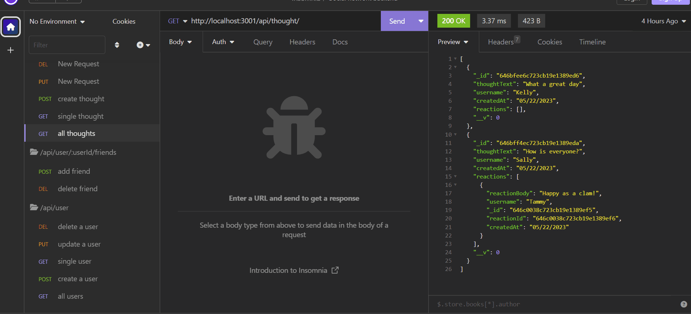

# social-network-backend
Social network API

## Technology Used 

| Technology Used         | Resource URL           | 
| ------------- |:-------------:| 
| MongoDB    | [https://www.mongodb.com/docs/](https://www.mongodb.com/docs/) | 
| Mongoose     | [https://mongoosejs.com/docs/index.html](https://mongoosejs.com/docs/index.html)      |   
| Git | [https://git-scm.com/](https://git-scm.com/)     |    
| JavaScript | [https://developer.mozilla.org/en-US/docs/Web/JavaScript](https://developer.mozilla.org/en-US/docs/Web/JavaScript)     |  
| Insomnia | [https://insomnia.rest/](https://insomnia.rest/)     |  
| Expressjs | [https://expressjs.com/](https://expressjs.com/)     |  
| Dayjs | [https://day.js.org/docs/en/installation/node-js](https://day.js.org/docs/en/installation/node-js)     |  

## Description 

[Walk through video](https://drive.google.com/file/d/1DKKG8Wm7jnB4EDIcZWZ64UYt3VsCGKtT/view)

Social network backend that uses MongoDB and mongoose to store user data, thoughts, friends and reactions.  A user can be created, updated and deleted. Upon user deletion their associated thoughts are also deleted.  A thought can be created, updated and deleted. A reaction can be created and deleted. 

## Table of Contents 

* [Installation](#installation)
* [Usage](#usage)
* [Learning Points](#learning-points)
* [Author Info](#author-info)
* [License](#license)

## Installation
npm i 
npm start

## Usage 
Can be used as the backend of a social network site

## Learning Points 
This project was a great introduction to MongoDB and mongoose.  I was able to learn about storing information with MongoDB and creating schemas and models with mongoose as well as retrieving the information stored.  
* MongoDB
* Mongoose

## Author Info

###  Shea Schwennicke

* [Portfolio](https://sheaschwenn.github.io/Portfolio/)
* [LinkedIn](https://www.linkedin.com/in/shea-schwennicke-76a378210/)
* [Github](https://github.com/sheaschwenn)

## License
MIT License 

More information in the LICENSE portion of the repository 

---

